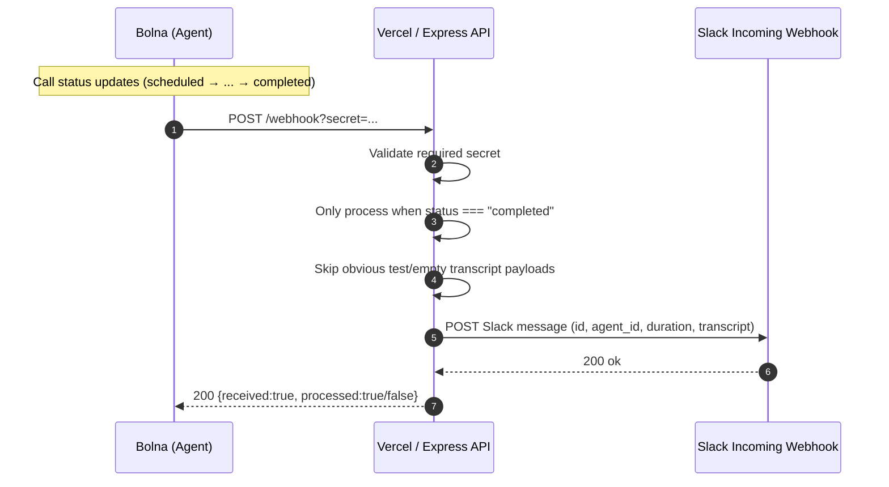

## Bolna → Slack Integration

Send a Slack alert whenever a Bolna call execution ends with status `completed`, including **id**, **agent_id**, **duration**, and **transcript**.

### Architecture / Flow



### What this does

- **Receives** Bolna execution webhooks at `POST /webhook`
- **Filters** all events except `status === "completed"`
- **Protects** the webhook with a **required** shared secret via URL param: `POST /webhook?secret=...` (must match `WEBHOOK_SECRET` in env)
- **Posts** a Slack message via **Slack Incoming Webhooks**
- **Truncates** transcript to stay under Slack Block Kit limits (3,000 chars)

### Endpoints

- **GET** `/` → quick “OK” page
- **GET** `/health` → JSON health check
- **POST** `/webhook` → Bolna execution updates

### Requirements

- Node.js 18+
- A Slack Incoming Webhook URL
- A Bolna agent with webhook configured

### Setup (Local)

1) Install dependencies

```bash
npm install
```

2) Create `.env`

```bash
cp .env.example .env
```

Fill in:

- `SLACK_WEBHOOK_URL` (Slack Incoming Webhook URL)
- `WEBHOOK_SECRET` (**required**; use a long URL-safe string, e.g. letters and numbers only)
- `PORT` (optional, defaults to 3000)

3) Run locally

```bash
npm run dev
```

Health check:

```bash
curl http://localhost:3000/health
```

### Deployed service (this project)

| | URL |
|---|-----|
| **App (root)** | `https://voice-agent-slack-pipeline.vercel.app/` |
| **Health** | `https://voice-agent-slack-pipeline.vercel.app/health` |
| **Webhook (Bolna)** | `https://voice-agent-slack-pipeline.vercel.app/webhook?secret=YOUR_WEBHOOK_SECRET` |

Replace `YOUR_WEBHOOK_SECRET` with the same value as `WEBHOOK_SECRET` in Vercel (and in your local `.env`).

### Setup (Vercel)

1) Connect this GitHub repo to Vercel
2) In **Vercel Project → Settings → Environment Variables**, set (both **required**):
   - `SLACK_WEBHOOK_URL`
   - `WEBHOOK_SECRET`
3) Redeploy after changing env vars

After deploy, use the URLs in **Deployed service** above (or your own Vercel domain if different).

### Setup (Bolna)

Bolna docs: `https://www.bolna.ai/docs/polling-call-status-webhooks`

In Bolna:

1) Open your **Agent**
2) Go to **Analytics tab**
3) Under **“Push all execution data to webhook”**, paste (use your real secret, not a placeholder):

`https://voice-agent-slack-pipeline.vercel.app/webhook?secret=YOUR_WEBHOOK_SECRET`

4) Click **Save agent**

### Local webhook testing (without Bolna)

Non-completed (should be ignored):

```bash
curl -X POST "http://localhost:3000/webhook?secret=YOUR_SECRET" \
  -H "Content-Type: application/json" \
  -d '{"id":"1277f04b-ac4d-4eb8-9f13-aeb6bbbbdd7c","agent_id":"agent-456","status":"in-progress","transcript":"hello","telephony_data":{"duration":1}}'
```

Completed (should send Slack message):

```bash
curl -X POST "http://localhost:3000/webhook?secret=YOUR_SECRET" \
  -H "Content-Type: application/json" \
  -d '{
    "id": "4c06b4d1-4096-4561-919a-4f94539c8d4a",
    "agent_id": "3c90c3cc-0d44-4b50-8888-8dd25736052a",
    "status": "completed",
    "transcript": "Agent: Hello!\\nUser: Hi!\\nAgent: How can I help?",
    "telephony_data": { "duration": 154 }
  }'
```

### Webhook filtering rules

- Only processes `status === "completed"`
- Ignores obvious test payloads where `id` is not a UUID (e.g. `id="test"`)
- Ignores completed payloads with an empty transcript to avoid Slack noise

### Common troubleshooting

- **No Slack messages**:
  - Ensure `SLACK_WEBHOOK_URL` is set in the environment (Vercel env vars for production)
  - Ensure the webhook payload has `status: "completed"`
- **401 unauthorized**:
  - Missing or wrong `?secret=...` in the request URL (must match `WEBHOOK_SECRET` exactly)
  - Use a URL-safe secret (letters/numbers) so Bolna’s URL field doesn’t need encoding
- **503 server_misconfigured**:
  - `WEBHOOK_SECRET` is missing from the environment — set it locally and on Vercel, then redeploy
- **413 Payload Too Large**:
  - Body exceeded `2mb` (`express.json({ limit: "2mb" })`)

### Expose localhost to Bolna (ngrok)

In a separate terminal:

```bash
ngrok http 3000
```

Copy the `https://...ngrok.io` URL and set your Bolna agent webhook URL to:

- `https://<your-ngrok-domain>/webhook?secret=YOUR_SECRET`

Bolna sends multiple execution updates per call; this integration only alerts on `completed`.

### Project structure

```
src/
  app.js
  server.js
  routes/
    webhook.js
  services/
    slack.js
  utils/
    formatDuration.js
```

### Notes

- Slack Incoming Webhooks return `200` with body `ok` on success.
- The webhook handler **always returns 200 to Bolna**, even if Slack fails, to avoid infinite retries.

